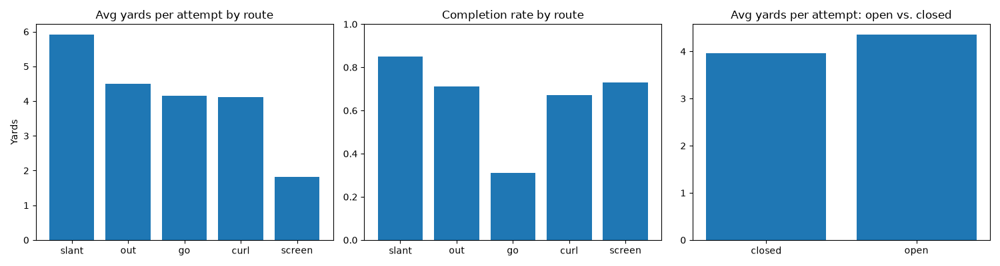

# Flag Football Analytics

Co-ed intramural flag football play data, built with SQLite, pandas, and matplotlib

Data is used to determine what routes and players are most effective depending on the play.

# Limitations
- data from games1 and plays1 is hypothetical, as data is logged throughout the season a new csv folder will be used
- data is logged by hand so there may be inaccuracies 

# How to run?
- install: pip install pandas matplotlib
- put 'analyze.py', 'plays1.csv', and 'games.csv' in the same folder
- run 'analyze.py'
